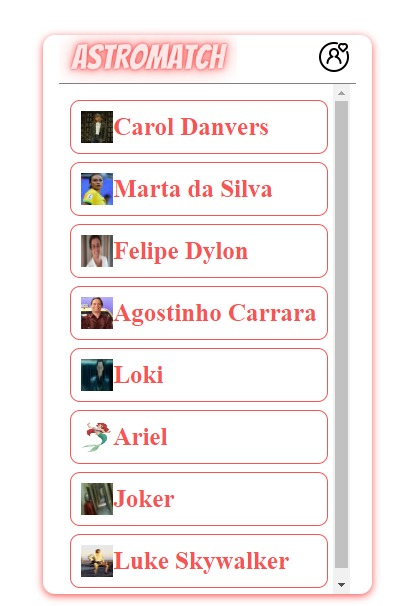

# Astromatch

## Desenvolvedor

- Gabriel Inácio Wenchenck de Carvalho

## Link

gabriel-carv-astromatch.surge.sh

## Descrição das funcionalidades do site:

- A aplicação é um clone do tinder, que consiste em duas telas, uma tela inicial para a exibição de perfis e uma tela de matches para a exibição perfis selecionados.
- Na tela inicial há o perfil dos usuários, contendo nome, foto idade e uma descrição, há também um botão para dar match no perfil e um botão para passar. Por fim, há um botão para ir até a tela de matches
- Na tela de matches há a lista dos perfis que deram match com o usuário, além do botão para voltar para a lista de perfis.

## O que funciona

- Todas as requisições da aplicação estão funcionando
- Todos os botões (match, passar, ir para a tela de matches e ir para a tela inicial) estão funcionando
- A lógica de aparecer um botão para resetar os perfis quando eles cabam, também está funcionando

## Imagens:

