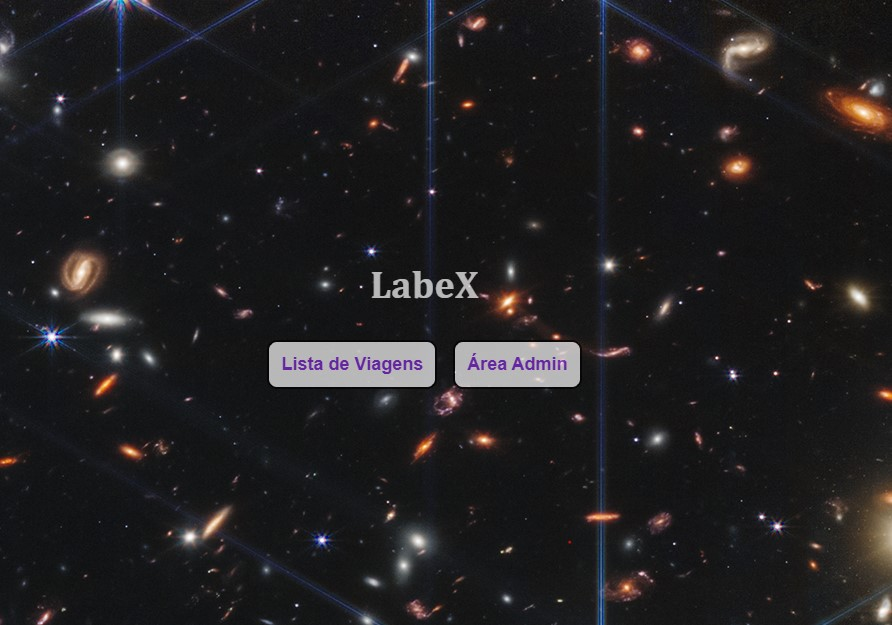
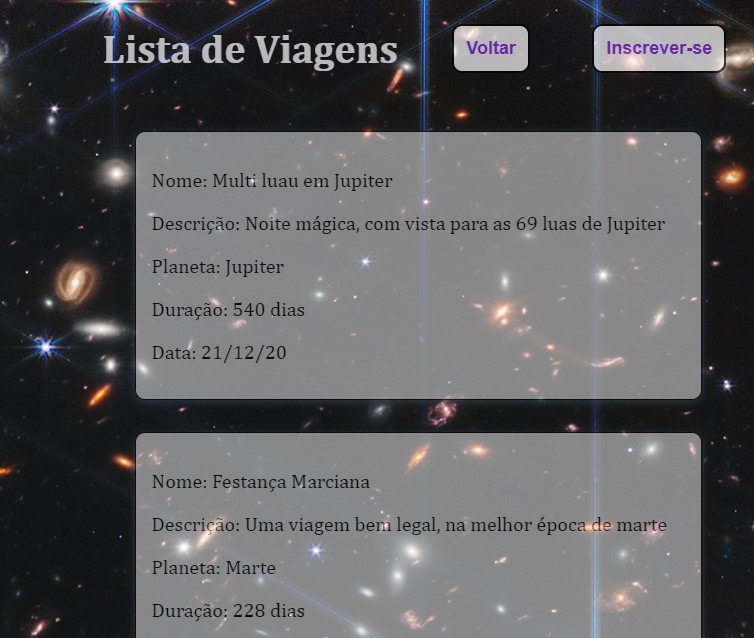
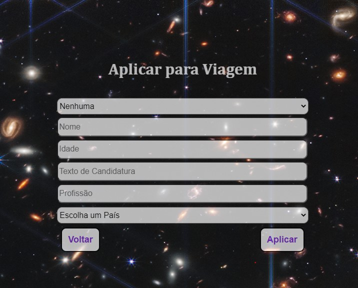
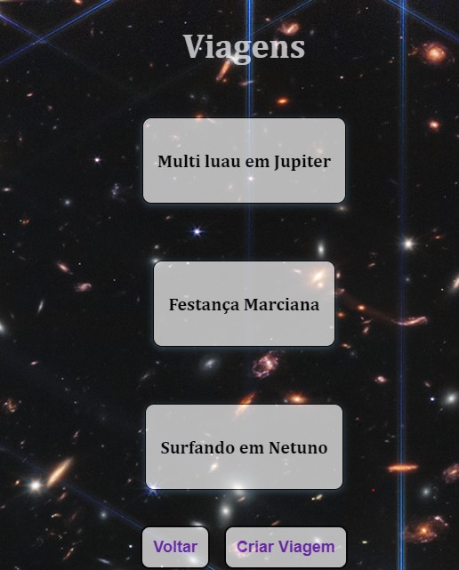
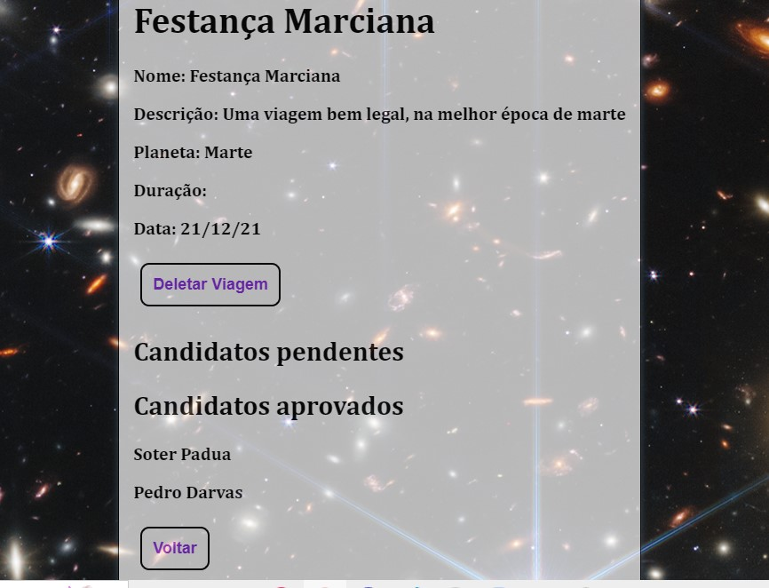
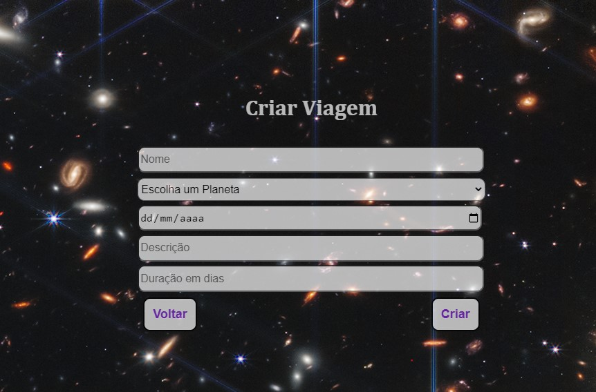

# Astromatch

## Desenvolvedor

- Gabriel Inácio Wenchenck de Carvalho

## Link

free-year.surge.sh

## Descrição das funcionalidades do site:

- A aplicação consiste em serviços de viagens espaciais, contendo sete telas divididas em públicas e privadas (admin).
- Na tela inicial há a opção de ir para a lista de viagens ou para á área administrativa.
- Na tela que contém a lista de viagens, há a descrição de cada viagem, além da opção de ir para uma página para se inscrever em alguma viagem.
- Já na área privada, há uma lista das viagens criadas, a opção de abrir detalhes de alguma viagem, bem como criar uma viagem.
- Ná página de detalhes das viagens, pode-se aceitar ou reprovar os candidatos pendentes, além da opção de deletar a viagem.

## O que funciona

- Inscrição em alguma viagem escolhida
- Login para a área administrativa
- Opção de criar uma viagem
- Aprovação / reprovação de candidatos
- Deletar Viagem

## O que não funciona

- Criar conta
- Logout

## Imagens:

